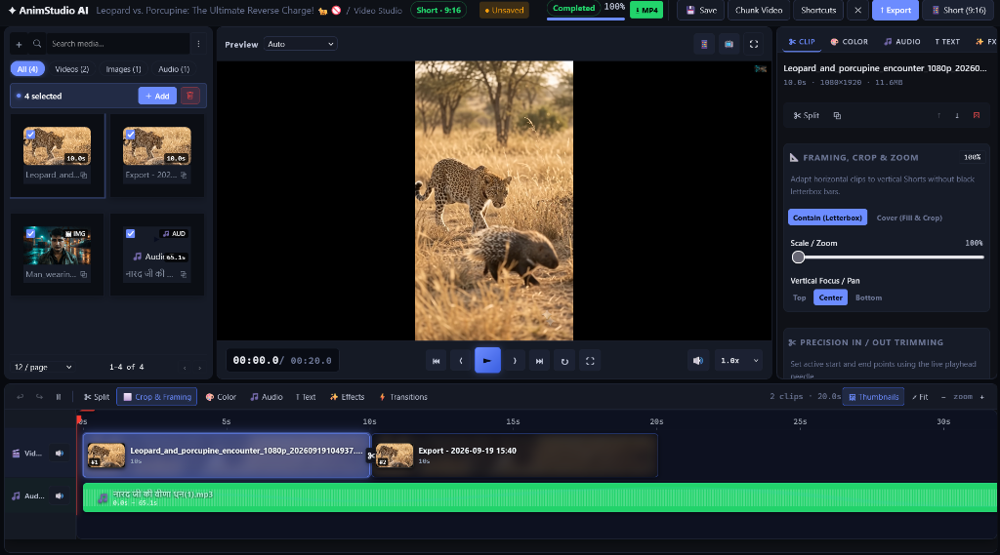
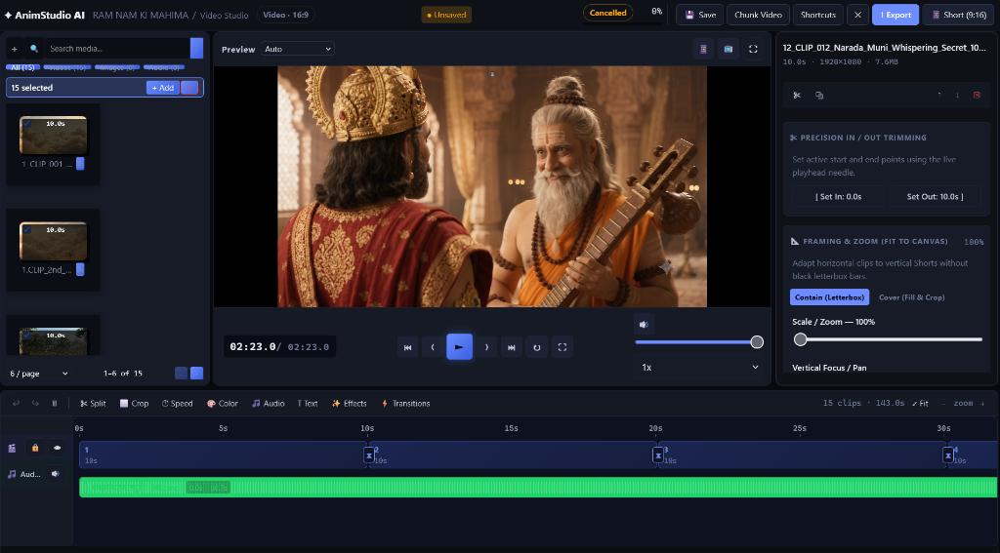
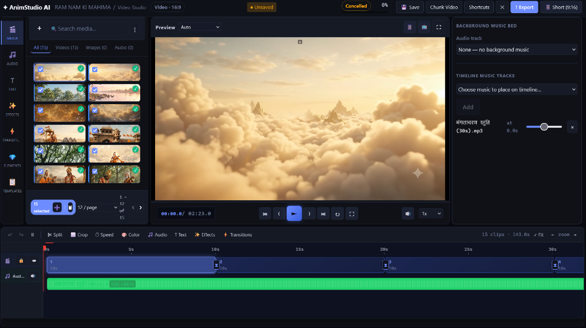
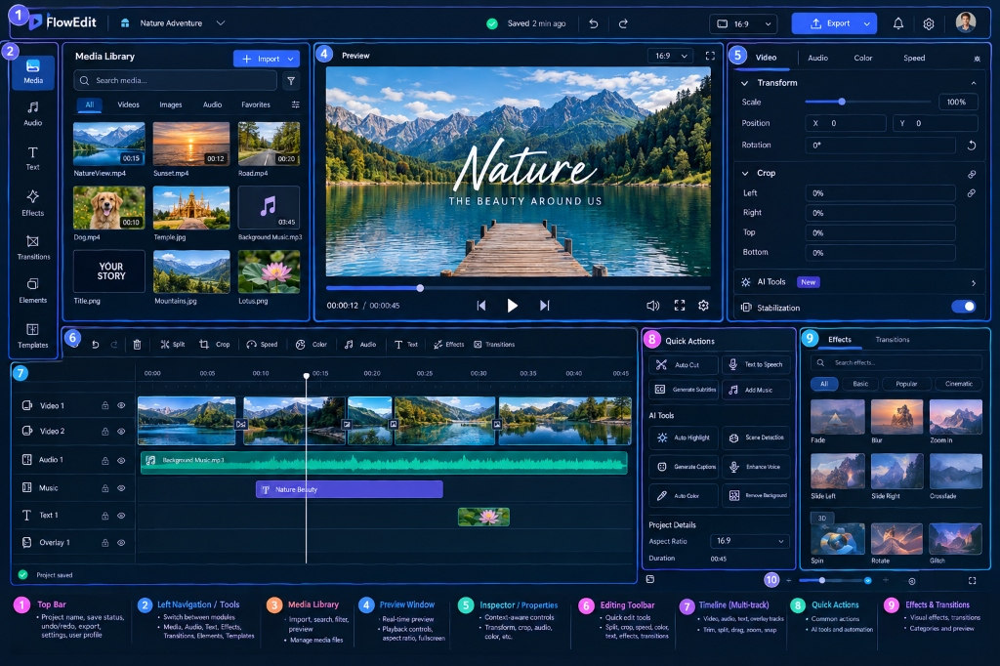
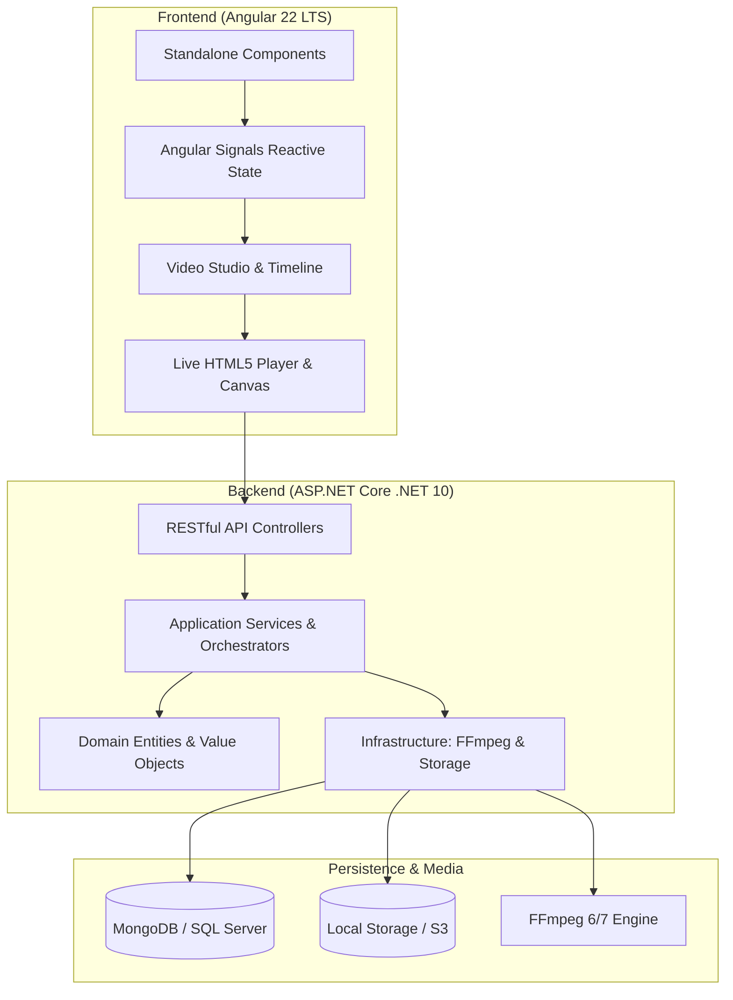

# 🎬 AnimStudio AI

<div align="center">

[](https://hacktoberfest.com/)
[](https://dotnet.microsoft.com/)
[](https://angular.dev/)
[](https://ffmpeg.org/)
[](LICENSE)
[](CONTRIBUTING.md)

**A modern, open-source AI-powered video creation studio & multi-track timeline editor.**  
Craft viral Shorts, Reels, YouTube videos, animated stories, and narrated slideshows with ease.

[Quick Start](#-quick-start) • [Features](#-key-features) • [Architecture](#-architecture--tech-stack) • [Setup Guide](docs/SETUP.md) • [Contributing](CONTRIBUTING.md) • [Roadmap](docs/ROADMAP.md)

</div>

---

## 📸 Screenshots

<div align="center">

### 📱 Vertical Studio (9:16 Shorts & Reels with Framing, Crop & Waveform Timeline)


<br/><br/>

### 🖥️ Widescreen Studio (16:9 Cinema Mode with Precision Trimming & Transitions)


<br/><br/>

### 🎵 Multi-Track Audio Engine & Timeline Music Cues


<br/><br/>

### 📐 Workspace Architectural Layout


</div>

---

## ✨ Key Features

### 🎞️ Video Studio 2.0
- **Multi-Track Timeline**: Synchronized video and audio tracks with playhead scrubbing, live waveform visualization, and thumbnail previews.
- **Precision Trimming & Splitting**: Split clips at playhead needle, trim In/Out points, duplicate clips, and arrange sequences effortlessly.
- **Seamless Live Transitions**: Real-time crossfades, directional slides, and wipe transitions with FFmpeg `xfade` integration.
- **Smart Aspect Ratio Switching**: Instant toggle between **16:9 (YouTube)**, **9:16 (Shorts/TikTok/Reels)**, **1:1 (Instagram)**, and **4:5** with automatic letterbox (Contain) or smart crop (Cover) scaling.

### 🎧 Audio & Sound Design
- **Background Music Bed**: Loopable ambient audio track with master volume control.
- **Timeline Music Cues**: Place multiple audio tracks at specific timestamps with independent volume sliders.
- **Intelligent Audio Ducking**: Automatically lower or mute video sound when a background music cue begins playing.

### 🎵 Music Release Kit
- **Distributor-Ready Master**: Two-pass loudness normalisation to -14 LUFS / -1 dBTP (or -16 / -11), 16- or 24-bit WAV at 44.1/48/96 kHz.
- **Artwork & Promo Videos**: 3000×3000 cover, a full-length 16:9 YouTube visualizer, and an 8-second 9:16 loop for Spotify Canvas, Reels and Shorts.
- **Release Sheet**: Metadata checked the way distributors check it (ISRC, UPC check digit, credits-in-title), exported as a copy-paste sheet and JSON. Upload the kit to the distributor of your choice; stores only accept releases through distributors.
- **Square Cover Crop & Remembered Details**: Crop a non-square cover yourself instead of a blind centre crop, and optionally keep artist, credits and label lines on your browser for the next release.
- **Go Live From the Kit**: Premiere the song (cover + live waveform) or its visualizer on YouTube Live in one click.

### 🔴 Go Live
- **Stream to YouTube Live without OBS**: The server is the encoder and sends over RTMPS. Streams run on the server, so closing the tab doesn't stop them.
- **Playlists From Anywhere**: Mix uploads, project renders, Clip Studio exports, project media, release kits and links (YouTube, Vimeo, Instagram, TikTok, X and more) in one stream. Reorder, rename, shuffle, and give songs a cover.
- **Prepare → Preview → Go Live**: Every item is converted to the exact stream format first, so you can watch each one, or the whole program, before anything is sent. Sending then just copies the files, so a 24/7 loop barely uses the CPU.
- **Saved Keys per Channel**: YouTube stream keys don't expire until reset, so admins save one per brand channel (encrypted, only ever shown masked). If YouTube refuses a key, the channel is flagged and you're asked to set it again. You can still paste a one-off key.
- **Resilient**: Automatic reconnect from the item that was playing, "go live again" without re-preparing, 720p or 1080p, landscape or vertical (Shorts feed).

### 📷 Camera Studio (live camera with identity protection)
- **Hide who you are**: On-device face tracking (MediaPipe, in the browser) covers every face with an animated character that copies your mouth, blinks and head tilt. You can pick one of 10 built-in characters, your project's own characters (they switch to the open-mouth image while you talk), your own image, an emoji, a block, pixelation or blur. Each person can get a different character.
- **Fails closed**: Until faces are tracked, while a face is briefly lost, or when a person is seen without a face (strict mode), the whole camera is covered. Go live is blocked until face tracking runs. Your real camera image never leaves your machine.
- **Body, background and voice**: Solid-silhouette, blurred or pixelated body; blurred, plain, animated or image background; voice changer (deep, high, robot, radio, alien) with noise suppression.
- **Overlays, each switchable**: LIVE badge with timer, people-on-camera count, name tags, live YouTube subscriber count with goal bar, live viewers, clock, name banner, scrolling ticker, watermark.
- **Show control**: Camera, screen, or screen plus camera in a corner; Starting soon (with countdown), Be right back, Ending and Privacy cards; hotkeys (1-5, P, F, M); auto-framing, looks and colour controls; presets with import/export; record to file; snapshot; pre-flight checklist and stream health.
- Subscriber and viewer counts need a YouTube Data API key on the server: `dotnet user-secrets set "YouTube:ApiKey" "…"` (or the `YouTube__ApiKey` env var / Key Vault). The face models are fetched by `npm run vision:models` (runs automatically before `npm start` / `npm run build`).

### 🎨 Color Grading & Effects
- **9 Cinematic LUT Filter Presets**: Natural, Cinematic Warm, Cool Sci-Fi, Vivid Pop, Golden Hour, Teal & Orange, Cyberpunk, Film Noir, and Faded 90s.
- **Text & Logo Watermarks**: Positionable text or logo watermarks (Top-Left, Top-Right, Bottom-Left, Bottom-Right, Center) with font and opacity controls.

### 🤖 AI Video Generation & Script Ingestion
- **Script Ingestion**: Paste raw script text, upload `.srt` / `.vtt` subtitles, or ingest YouTube video captions directly via `yt-dlp`.
- **Pluggable AI Providers**: Modular provider architecture supporting **Groq**, **Google Gemini**, **OpenRouter**, **Ollama**, **Cloudflare AI**, **Hugging Face**, and **ComfyUI**.
- **Speech Synthesis (TTS)**: Support for local **Kokoro** and **Piper** voice synthesis models.
- **Automated Caption Segmentation**: Intelligent sentence boundary detection, word-level timestamps, and subtitle formatting.

### 🚀 High-Performance FFmpeg Rendering Engine
- **Hardware-Probed Filter Graphs**: Generates optimized FFmpeg filtergraphs supporting `libass` burned subtitles, `libx264` encoding, and Ken Burns motion.
- **Lease-Based Job Queue**: Robust background worker architecture designed for distributed video encoding jobs with auto-cleanup and failure recovery.

---

## 🏗️ Architecture & Tech Stack



| Layer | Technology |
| --- | --- |
| **Backend** | ASP.NET Core (.NET 10.0 Web API), C# 13, Minimal APIs + Controllers |
| **Persistence** | MongoDB (6.0+) or Microsoft SQL Server (2019+), EF Core / Dapper |
| **Media Processing** | FFmpeg (6.0+ or 7.0+ full build with `libass` & `libx264`), `yt-dlp` |
| **Frontend** | Angular 22, TypeScript 6, Tailwind CSS & Modern CSS Custom Properties |
| **State Management** | Angular Signals (`signal()`, `computed()`), Standalone Components |

---

## ⚡ Quick Start

### 1. Prerequisites
Ensure you have the following installed:
- [.NET 10 SDK](https://dotnet.microsoft.com/download/dotnet/10.0)
- [Node.js 22 LTS](https://nodejs.org/) & npm
- [FFmpeg 6.0+](https://ffmpeg.org/) *(ensure `ffmpeg` and `ffprobe` are on your PATH)*
- [MongoDB](https://www.mongodb.com/try/download/community) *(or local SQL Server)*

> 💡 **Tip for Windows users**: You can install everything with `winget`:
> ```powershell
> winget install Microsoft.DotNet.SDK.10 OpenJS.NodeJS.LTS Gyan.FFmpeg MongoDB.Server Git.Git
> ```
> See [docs/SETUP.md](docs/SETUP.md) for full Linux, macOS, and Windows instructions.

---

### 2. Run the Application

#### 🚀 Option A: One-Click Launcher (Windows)
Double-click `run.bat` in the repository root. It launches both backend and frontend in Windows Terminal with live logs.

#### 🛠️ Option B: Manual Terminal Launch

**Terminal 1 — Backend:**
```bash
cd backend/AnimStudio.Api
dotnet run
```
*API runs at `http://localhost:5000` (Swagger at `http://localhost:5000/swagger`).*

**Terminal 2 — Frontend:**
```bash
cd frontend
npm install
npm start
```
*Frontend runs at `http://localhost:4200`.*

---

## ⚙️ Configuration & Secrets

AnimStudio AI follows strict security practices. **No secrets or credentials are ever committed to configuration files.**

### Database Setup
To set your local MongoDB connection string:
```bash
cd backend/AnimStudio.Api
dotnet user-secrets set "Mongo:ConnectionString" "mongodb://localhost:27017"
```

Or for SQL Server:
```bash
dotnet user-secrets set "SqlServer:ConnectionString" "Server=localhost;Database=AnimStudioDb;Trusted_Connection=True;TrustServerCertificate=True;"
```

### AI Provider Keys (Optional)
AI keys can be added via User Secrets or through the built-in Admin Settings UI:
```bash
dotnet user-secrets set "Ai:Secrets:groq" "gsk_your_groq_api_key"
dotnet user-secrets set "Ai:Secrets:gemini" "your_gemini_api_key"
```

---

## 🤝 Contributing & Hacktoberfest

We love contributions! Whether you're fixing bugs, adding new audio/video filters, polishing UI components, or adding documentation:

1. Read our [Contributing Guide](CONTRIBUTING.md).
2. Check open issues labeled [`good first issue`](https://github.com/keshavsingh3197/Keshav-AnimStudio-AI/labels/good%20first%20issue) or [`hacktoberfest`](https://github.com/keshavsingh3197/Keshav-AnimStudio-AI/labels/hacktoberfest).
3. Fork, branch, code, and submit a PR!

---

## 🔒 Security

Security issues and vulnerabilities should be reported responsibly according to our [Security Policy](SECURITY.md). Please do not open public issues containing sensitive vulnerability details.

---

## 📄 License

This project is licensed under the [MIT License](LICENSE) — see the [LICENSE](LICENSE) file for details.

---

<div align="center">

Made with ❤️ by [Keshav Singh](https://github.com/keshavsingh3197) and open-source contributors.

⭐ **Star this repository if you find it helpful!**

</div>
