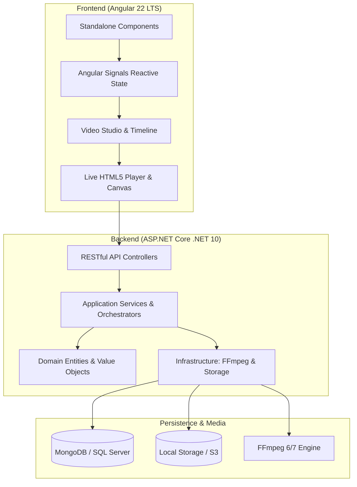

# 🎬 AnimStudio AI

<div align="center">

[](https://hacktoberfest.com/)
[](https://dotnet.microsoft.com/)
[](https://angular.dev/)
[](https://ffmpeg.org/)
[](LICENSE)
[](CONTRIBUTING.md)

**A modern, open-source AI-powered video creation studio & multi-track timeline editor.**  
Craft viral Shorts, Reels, YouTube videos, animated stories, and narrated slideshows with ease.

[Quick Start](#-quick-start) • [Features](#-key-features) • [Architecture](#-architecture--tech-stack) • [Setup Guide](docs/SETUP.md) • [Contributing](CONTRIBUTING.md) • [Roadmap](docs/ROADMAP.md)

</div>

---

## 📸 Screenshots

<div align="center">

### 📱 Vertical Studio (9:16 Shorts & Reels with Framing, Crop & Waveform Timeline)


<br/><br/>

### 🖥️ Widescreen Studio (16:9 Cinema Mode with Precision Trimming & Transitions)


<br/><br/>

### 🎵 Multi-Track Audio Engine & Timeline Music Cues


<br/><br/>

### 📐 Workspace Architectural Layout


</div>

---

## ✨ Key Features

### 🎞️ Video Studio 2.0
- **Multi-Track Timeline**: Synchronized video and audio tracks with playhead scrubbing, live waveform visualization, and thumbnail previews.
- **Precision Trimming & Splitting**: Split clips at playhead needle, trim In/Out points, duplicate clips, and arrange sequences effortlessly.
- **Seamless Live Transitions**: Real-time crossfades, directional slides, and wipe transitions with FFmpeg `xfade` integration.
- **Smart Aspect Ratio Switching**: Instant toggle between **16:9 (YouTube)**, **9:16 (Shorts/TikTok/Reels)**, **1:1 (Instagram)**, and **4:5** with automatic letterbox (Contain) or smart crop (Cover) scaling.

### 🎧 Audio & Sound Design
- **Background Music Bed**: Loopable ambient audio track with master volume control.
- **Timeline Music Cues**: Place multiple audio tracks at specific timestamps with independent volume sliders.
- **Intelligent Audio Ducking**: Automatically lower or mute video sound when a background music cue begins playing.

### 🎨 Color Grading & Effects
- **9 Cinematic LUT Filter Presets**: Natural, Cinematic Warm, Cool Sci-Fi, Vivid Pop, Golden Hour, Teal & Orange, Cyberpunk, Film Noir, and Faded 90s.
- **Text & Logo Watermarks**: Positionable text or logo watermarks (Top-Left, Top-Right, Bottom-Left, Bottom-Right, Center) with font and opacity controls.

### 🤖 AI Video Generation & Script Ingestion
- **Script Ingestion**: Paste raw script text, upload `.srt` / `.vtt` subtitles, or ingest YouTube video captions directly via `yt-dlp`.
- **Pluggable AI Providers**: Modular provider architecture supporting **Groq**, **Google Gemini**, **OpenRouter**, **Ollama**, **Cloudflare AI**, **Hugging Face**, and **ComfyUI**.
- **Speech Synthesis (TTS)**: Support for local **Kokoro** and **Piper** voice synthesis models.
- **Automated Caption Segmentation**: Intelligent sentence boundary detection, word-level timestamps, and subtitle formatting.

### 🚀 High-Performance FFmpeg Rendering Engine
- **Hardware-Probed Filter Graphs**: Generates optimized FFmpeg filtergraphs supporting `libass` burned subtitles, `libx264` encoding, and Ken Burns motion.
- **Lease-Based Job Queue**: Robust background worker architecture designed for distributed video encoding jobs with auto-cleanup and failure recovery.

---

## 🏗️ Architecture & Tech Stack



| Layer | Technology |
| --- | --- |
| **Backend** | ASP.NET Core (.NET 10.0 Web API), C# 13, Minimal APIs + Controllers |
| **Persistence** | MongoDB (6.0+) or Microsoft SQL Server (2019+), EF Core / Dapper |
| **Media Processing** | FFmpeg (6.0+ or 7.0+ full build with `libass` & `libx264`), `yt-dlp` |
| **Frontend** | Angular 22, TypeScript 6, Tailwind CSS & Modern CSS Custom Properties |
| **State Management** | Angular Signals (`signal()`, `computed()`), Standalone Components |

---

## ⚡ Quick Start

### 1. Prerequisites
Ensure you have the following installed:
- [.NET 10 SDK](https://dotnet.microsoft.com/download/dotnet/10.0)
- [Node.js 22 LTS](https://nodejs.org/) & npm
- [FFmpeg 6.0+](https://ffmpeg.org/) *(ensure `ffmpeg` and `ffprobe` are on your PATH)*
- [MongoDB](https://www.mongodb.com/try/download/community) *(or local SQL Server)*

> 💡 **Tip for Windows users**: You can install everything with `winget`:
> ```powershell
> winget install Microsoft.DotNet.SDK.10 OpenJS.NodeJS.LTS Gyan.FFmpeg MongoDB.Server Git.Git
> ```
> See [docs/SETUP.md](docs/SETUP.md) for full Linux, macOS, and Windows instructions.

---

### 2. Run the Application

#### 🚀 Option A: One-Click Launcher (Windows)
Double-click `run.bat` in the repository root. It launches both backend and frontend in Windows Terminal with live logs.

#### 🛠️ Option B: Manual Terminal Launch

**Terminal 1 — Backend:**
```bash
cd backend/AnimStudio.Api
dotnet run
```
*API runs at `http://localhost:5000` (Swagger at `http://localhost:5000/swagger`).*

**Terminal 2 — Frontend:**
```bash
cd frontend
npm install
npm start
```
*Frontend runs at `http://localhost:4200`.*

---

## ⚙️ Configuration & Secrets

AnimStudio AI follows strict security practices. **No secrets or credentials are ever committed to configuration files.**

### Database Setup
To set your local MongoDB connection string:
```bash
cd backend/AnimStudio.Api
dotnet user-secrets set "Mongo:ConnectionString" "mongodb://localhost:27017"
```

Or for SQL Server:
```bash
dotnet user-secrets set "SqlServer:ConnectionString" "Server=localhost;Database=AnimStudioDb;Trusted_Connection=True;TrustServerCertificate=True;"
```

### AI Provider Keys (Optional)
AI keys can be added via User Secrets or through the built-in Admin Settings UI:
```bash
dotnet user-secrets set "Ai:Secrets:groq" "gsk_your_groq_api_key"
dotnet user-secrets set "Ai:Secrets:gemini" "your_gemini_api_key"
```

---

## 🤝 Contributing & Hacktoberfest

We love contributions! Whether you're fixing bugs, adding new audio/video filters, polishing UI components, or adding documentation:

1. Read our [Contributing Guide](CONTRIBUTING.md).
2. Check open issues labeled [`good first issue`](https://github.com/keshavsingh3197/Keshav-AnimStudio-AI/labels/good%20first%20issue) or [`hacktoberfest`](https://github.com/keshavsingh3197/Keshav-AnimStudio-AI/labels/hacktoberfest).
3. Fork, branch, code, and submit a PR!

---

## 🔒 Security

Security issues and vulnerabilities should be reported responsibly according to our [Security Policy](SECURITY.md). Please do not open public issues containing sensitive vulnerability details.

---

## 📄 License

This project is licensed under the [MIT License](LICENSE) — see the [LICENSE](LICENSE) file for details.

---

<div align="center">

Made with ❤️ by [Keshav Singh](https://github.com/keshavsingh3197) and open-source contributors.

⭐ **Star this repository if you find it helpful!**

</div>
